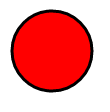

# Lekcja 1 – Markdown lekki język znaczników 

**Spis** **treści**

1. [Lekcja 1 – Markdown lekki język znaczników](#Lekcja1)
    1. [Wstęp](#Wstęp)
    2. [Podstawy składni](#Podstawyskładni)
    3. [Definiowanie nagłówków](#Definiowanienagłówków)
    4. [Definiowanie list](#Definiowanielist)
    5. [Wyróżnienie Tekstu](#Wyróżnienietekstu)
    6. [Tabele](#Tabele)
    7. [Odnośniki do zasobów](#Odnośnikidozasobów)
    8. [Obrazki](#Obrazki)
    9. [Kod źródłowy dla różnych języków programowania](#Kodźródłowy)
    10. [Tworzenie spisu treści na podstawie nagłówków](#Spistreści)
    11. [Edytory dedykowane](#Edytorydedykowane)
    12. [Pandoc – system do konwersji dokumentów Markdown do innych formatów](#Pandoc)
  
   ## Wstęp 

Obecnie powszechnie wykorzystuje się języki ze znacznikami do opisania
dodatkowych informacji

umieszczanych w plikach tekstowych. Z pośród najbardziej popularnych
można wspomnieć o:

> 1\. **html** – służącym do opisu struktury informacji zawartych na
> stronach internetowych,
>
> 2\. **Tex** (Latex) – poznany na zajęciach język do „profesjonalnego”
> składania tekstów,
>
> 3\. **XML** (Extensible Markup Language) - uniwersalnym języku
> znaczników przeznaczonym
>
> do reprezentowania różnych danych w ustrukturalizowany sposób.

Przykład kodu *html* i jego interpretacja w przeglądarce:

\<!DOCTYPE **html**\>

\<**html**\>

\<**head**\>

\<**meta** charset="utf-8" /\> \<title\>Przykład\</title\> \</**head**\>

\<**body**\>

\<**p**\> Jakiś paragraf tekstu\</**p**\> \</**body**\>

\</**html**\>

Przykład kodu *Latex* i wygenerowanego pliku w formacie *pdf*

\documentclass\[\]{letter}

\usepackage{lipsum} 

\usepackage{polyglossia} 

\setmainlanguage{polish}

\\**begin**{**document**} 

\\**begin**{**letter**}{**Szanowny** **Panie** **XY**}

\address{Adres do korespondencji} 

\opening{}

\lipsum\[2\] 

\signature{Nadawca}

\closing{Pozdrawiam}

\\**end**{**letter**} 

\\**end**{**document**}

Przykład kodu *XML* – fragment dokumentu *SVG* (Scalar Vector Graphics)

\<!DOCTYPE **html**\>

\<**html**\>

\<**body**\>

\<svg height="100" width="100"\>

\<circle cx="50" cy="50" r="40" stroke="black" stroke-width="3" fill="red" /\>

\</svg\>

\</**body**\>

\</**html**\>

W tym przypadku mamy np. znacznik np. *\<circle\>* opisujący parametry koła i który może być właściwie zinterpretowany przez dedykowaną aplikację (np. przeglądarki www).

Jako ciekawostkę można podać fakt, że również pakiet MS Office wykorzystuje format XML do przechowywania informacji o dodatkowych parametrach formatowania danych. Na przykład pliki z rozszerzeniem *docx*, to nic innego jak spakowane algorytmem zip katalogi z plikami xml.

Przykład rozpakowania zawartości pliku *test.docx* poleceniem: **unzip**

\$unzip -l test.docx

Archive: test.docx

|Length | Date     | Time     | Name     |
| ----- | -------- | -------- | -------- |
| 573   | 2022-03-20 | 08:55  | \_rels/.rels   |
| 731   | 2022-03-20 | 08:55  | docProps/core.xml   |
| 508   | 2022-03-20 | 08:55  | docProps/app.xml   |
| 531   | 2022-03-20 | 08:55  | word/\_rels/document.xml.rels   |
| 1288  | 2022-03-20 | 08:55  | word/document.xml |
| 2429  | 2022-03-20 | 08:55  | word/styles.xml |
| 853 | 2022-03-20 | 08:55  | word/fontTable.xml |
| 257 | 2022-03-20 | 08:55  | word/settings.xml |
| 1374 | 2022-03-20 | 08:55  | \[Content_Types\].xml |

Wszystkie te języki znaczników cechują się rozbudowaną i złożoną składnią i dlatego do ich edycji wymagają najczęściej dedykowanych narzędzi w postaci specjalizowanych edytorów. By wyeliminować powyższą niedogodność powstał **Markdown** uproszczony język znaczników służący do formatowania dokumentów tekstowych (bez konieczności używania specjalizowanych narzędzi). Dokumenty w tym formacie można bardzo łatwo konwertować do wielu innych formatów: np. html, pdf, ps (postscript), epub, xml i wiele innych. Format ten jest powszechnie używany do tworzenia plików README.md (w projektach open source) i powszechnie obsługiwany przez serwery git’a. Język ten został stworzony w 2004 r. a jego twórcami byli John Gruber i Aaron Swartz. W kolejnych latach podjęto prace w celu stworzenia standardu rozwiązania i tak w 2016 r. opublikowano dokument [<u>RFC 7764</u>](https://tools.ietf.org/html/rfc7764) który zawiera opis kilku odmian tegoż języka:

 * CommonMark,
 * GitHub Flavored Markdown (GFM),
 * Markdown Extra.

## Podstawy składni 

Podany link: [<u>https://github.com/adam-p/markdown-here/wiki/Markdown-Cheatsheet</u>](https://github.com/adam-p/markdown-here/wiki/Markdown-Cheatsheet) zawiera opis podstawowych elementów składni w języku angielskim. Poniżej zostanie przedstawiony ich krótki opis w języku polskim.

## Definiowanie nagłówków 

W tym celu używamy znaku kratki 

Lewe okno zawiera kod źródłowy – prawe -podgląd przetworzonego tekstu

# Definiowanie list 

Listy numerowane definiujemy wstawiając numery kolejnych pozycji zakończone kropką.

Listy nienumerowane definiujemy znakami: \*,+,-

## Wyróżnianie tekstu 

